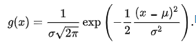
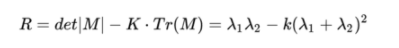
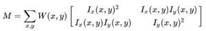
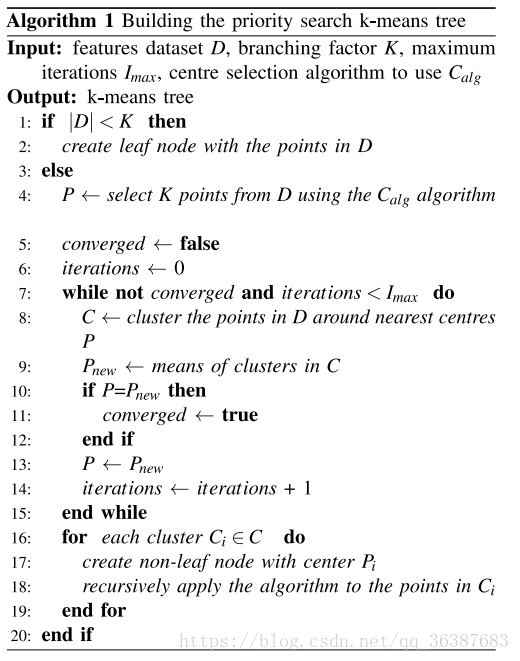
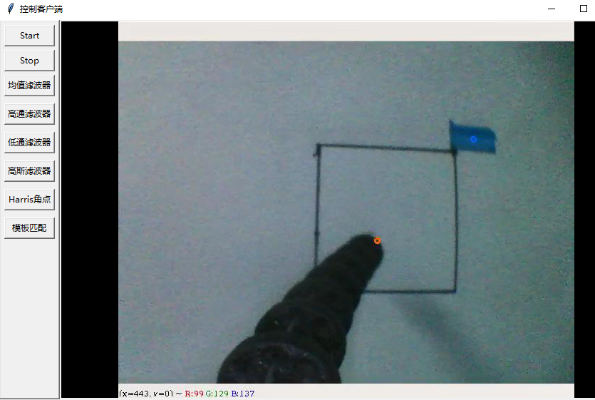
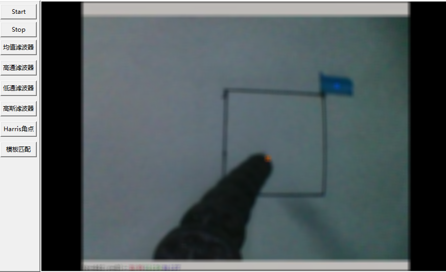

# robot_sim

该项目通过在模拟机器人服务器发送图像，显示经压缩处理后通过各种图像滤波器处理图像后结果

该项目基于本地数据集

### Step 1: 安装扩展库 ###
 

需要环境：
OpenCV: `pip install cv2`
PIL: `pip install pillow`
Tkinter: python自带

### 系统逻辑 ###
该程序基于python UDP socket库，并采用socket.SOCK_DGRAM协议。
服务端通过两个线程：监听和发送线程，初始监听线程监听客户端发送信号。当接收到Start信号提示发送线程开始发送。发送线程首先将PNG文件转为RGB格式image类型变量，并通过IO字节流将image变量编码为JPEG。发送的内容最开始是字节流大小。以结构包头的格式打包发送。接着把字节流分为可接收最大字节大小(1024)分包发送。
直到接收到客户端stop指令或者发送完成停止发送。

客户端由Tkinter UI组件组成。开始、图像处理、停止模式。首先通过用户点击start发送开始信号给服务端。接着在监听线程监听服务器发送内容，先接受包头的文件大小，并将图像字节流分包接收直到字节大小达到接收的文件大小。并转化为RGB格式的image变量保存在类定义的显示变量中。显示的方法是基于Tkinter的frame继承方法。通过在类初始阶段初始显示方法线程。并在start点击后开启显示方法线程。当线程获得类内部的显示变量后将图像变量结果推入队列中，并触发frame内部时间函数。内部函数将队列中图像数组取出并显示。

#### 图像处理模式 ###
图像处理设置在显示线程通过改变类变量中的模式变量控制UI界面显示，此程序添加了均值滤波器、高通滤波器、低通滤波器、高斯滤波器、Harris角点、以及FLANN模板匹配算法。
均值滤波器是一个9x9大小的平均值滤波器，在通过矩阵padding,像素值归一化等操作后，通过滤波器的for循环对整体矩阵进行求平均操作代替对输入矩阵的像素迭代，一定程度减少时间计算。

高通滤波器是一个3x3大小的核，在3x3的核中其显示为
[[-1,-1,-1]
 [-1,8,-1]
 [-1,-1,-1]]的矩阵。8为周围-1值的总和取反

低通滤波器是一个3x3大小的核，在3x3的核中其显示为
[[0.11,0.11,0.11]
 [0.11,0.11,0.11]
 [0.11,0.11,0.11]]的矩阵。0.11为1.0除以3x3核的大小9

高斯滤波器是一个9x9大小的核，在3x3的核中以高斯公式计算，公式如下：

  

其中x为像素点在核里面(x,y)方向的位置，μ为中心点的(x,y)坐标值, σ为sigma方差值，这里设置为1

Harris角点的计算公式如下：

  

  

其中
Ix为像素点在x方向的梯度，Iy为像素点在y方向的梯度, K这里设置为0.04,当R的值大于一定的阈值，可判断其为角点

快速最近邻搜索(FLANN)匹配算法
该算法通过SIFT计算出的距离和描述特征，在优先搜索k-means树算法找出最近的距离，若计算图像匹配的像素点距离小于模板的像素点距离。则选取为匹配点

  

  

方法先通过随机创建中心点，并且通过遍历邻近方法找到聚类的均值点和此前选择中心点近乎重合的点，并更新该点为新的中心点。如此重复，直到中心点数目达到K个。
遍历邻近方法为，寻找所有未查询点中距离最近的一个，直到聚类群体中的点的数目达到设置的最小数目。

### Step 2(方法): Python运行客户端###
服务端已作为线程写入客户端主函数

`python3 client.py
`
点击start后可尝试不同图像结果。或者先选择图像处理模式再点击start

### 测试结果 ###
输入图像：

  

低通滤波器图像：

  

高通滤波器图像：

  

高斯滤波器图像：

  

Harris角点图像：

  

FLANN模板匹配图像：

  

